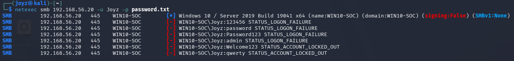
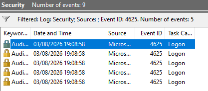
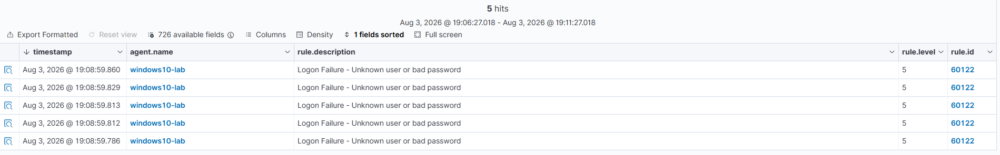

# Scenario 01 - SMB Brute Force Login Detection

## 📖 Overview

This scenario simulates an SMB brute force attack against a Windows 10 endpoint using **NetExec** from a Kali Linux attacker machine.

The objective is to validate the complete detection pipeline by generating Windows Security Event ID **4625**, forwarding the event to **Wazuh SIEM**, and performing a basic SOC investigation based on the collected telemetry.

---

# 🎯 Objective

- Simulate an SMB brute force attack.
- Generate Windows Security Event ID **4625**.
- Verify that Wazuh successfully collects and detects the event.
- Perform an initial SOC investigation.
- Map the activity to the MITRE ATT&CK Framework.

---

# 🧪 Lab Environment

| Component      | Description          |
| -------------- | -------------------- |
| Attacker       | Kali Linux           |
| Target         | Windows 10           |
| SIEM           | Wazuh                |
| Endpoint Agent | Wazuh Agent          |
| Telemetry      | Windows Security Log |
| Virtualization | Oracle VirtualBox    |

---

# 🗺️ MITRE ATT&CK

| Tactic            | Technique   | ID    |
| ----------------- | ----------- | ----- |
| Credential Access | Brute Force | T1110 |

---

# ⚔️ Attack Scenario

An attacker attempts to authenticate repeatedly against the SMB service on a Windows endpoint using multiple password guesses.

The objective is not to compromise the system, but to generate failed authentication events that can be detected by the SOC.

---

# 🛠 Attack Execution

Tool used:

- NetExec

Target Service:

- SMB (TCP/445)

Example command:

```bash
netexec smb <TARGET_IP> -u <USERNAME> -p passwords.txt
```

---

# 🔍 Detection Workflow

```text
NetExec
      │
      ▼
Windows SMB Authentication
      │
      ▼
Windows Security Event Log
(Event ID 4625)
      │
      ▼
Wazuh Agent
      │
      ▼
Wazuh Manager
      │
      ▼
Threat Hunting Dashboard
```

---

# 📑 Windows Event Analysis

Generated Event:

| Field      | Value                |
| ---------- | -------------------- |
| Event ID   | 4625                 |
| Log Source | Windows Security Log |
| Event Type | Failed Logon         |
| Protocol   | SMB                  |
| Logon Type | 3 (Network Logon)    |

The Windows endpoint generated Event ID **4625** for each failed authentication attempt performed by NetExec.

---

# 🛡️ Wazuh Detection

The Wazuh agent collected the Windows Security Event Log and forwarded the event to the Wazuh Manager.

The detection confirms that failed SMB authentication attempts are successfully monitored by the SIEM.

---

# 🚨 Indicators of Compromise (IOC)

| Indicator      | Description           |
| -------------- | --------------------- |
| Source IP      | Kali Linux IP Address |
| Destination IP | Windows 10 IP Address |
| Username       | Local Windows Account |
| Event ID       | 4625                  |
| Logon Type     | 3                     |
| Protocol       | SMB                   |
| Port           | TCP/445               |

---

# 🔎 Investigation Summary

### Attack Vector

SMB Brute Force

### Detection Source

Windows Security Event Log

### Detection Method

Wazuh SIEM

### Result

Successful detection of failed SMB authentication attempts.

---

# 📸 Evidence

## NetExec Execution



---

## Windows Event Viewer



---

## Wazuh Alert



---

# 📂 Collected Logs

| File             | Description            |
| ---------------- | ---------------------- |
| event4625.xml    | Windows Security Event |
| wazuh-alert.json | Wazuh Raw Alert        |

---

## ⚠️ Troubleshooting

During the initial phase of this scenario, **Hydra v9.7** was evaluated to simulate an SMB brute force attack against the Windows 10 endpoint.

Before changing the attack tool, several validation steps were performed to verify that the lab environment was functioning correctly:

- Verified network connectivity between Kali Linux and Windows 10.
- Confirmed that TCP port **445 (SMB)** was open.
- Verified that the **LanmanServer** service was running.
- Successfully authenticated to the SMB service using `smbclient`.
- Confirmed that Windows supported SMB2/SMB3 protocols.

Despite these successful validation steps, Hydra consistently returned the following error during SMB authentication attempts:

```text
[ERROR] invalid reply from target smb://<TARGET_IP>:445/
```

Because the authentication process did not complete successfully, Windows did not generate **Security Event ID 4625**, preventing the scenario from meeting its detection objective.

To preserve the objective of the exercise while maintaining compatibility with the Windows SMB implementation used in this lab, the attack simulation was performed using **NetExec**, which successfully generated Windows Security Event ID **4625**.

This change did **not** alter the purpose of the scenario, as both Hydra and NetExec simulate the same attack technique:

- **MITRE ATT&CK T1110 – Brute Force**

## 💡 Lessons Learned

- Attack simulation tools should always be validated before being used in a detection lab.
- Verifying the underlying service (SMB) helps distinguish between tool compatibility issues and infrastructure problems.
- Windows Security Event ID **4625** is a reliable indicator for failed SMB authentication attempts.
- NetExec proved to be a compatible tool for generating authentication failure events in this lab environment.
- Effective troubleshooting is an essential skill for both offensive security practitioners and SOC analysts.

# ✅ Conclusion

This scenario successfully demonstrated the detection of an SMB brute force attack using Wazuh.

Failed authentication attempts generated Windows Security Event ID 4625, which was successfully collected by the Wazuh agent and made available for SOC investigation.

The scenario validates the complete detection workflow from attack simulation through security monitoring and provides a foundation for future detection engineering and threat hunting exercises.

```

```
