# Scenario 2 – PowerShell Execution Detection


---

# 📌 Scenario Overview

This scenario demonstrates how suspicious PowerShell execution can be detected and investigated using **Sysmon** and **Wazuh SIEM**.

Instead of executing malicious code, the simulation focuses on generating PowerShell activity that resembles techniques commonly monitored by Security Operations Centers (SOC). The generated endpoint telemetry is collected by the Wazuh Agent, analyzed by the Wazuh Manager, and presented through the Wazuh Dashboard for investigation.

This scenario validates the complete detection workflow, from PowerShell execution to alert generation and analyst investigation.

---

# 🎯 Objectives

- Simulate PowerShell execution on a Windows endpoint.
- Validate Sysmon Process Creation logging.
- Validate PowerShell Operational Logging.
- Verify log collection by the Wazuh Agent.
- Investigate alerts generated by Wazuh default detection rules.
- Perform basic threat hunting using the Wazuh Dashboard.
- Map the observed activity to the MITRE ATT&CK Framework.

---

# 🖥️ Lab Environment

| Component           | Description                    |
| ------------------- | ------------------------------ |
| Target Endpoint     | Windows 10                     |
| SIEM Server         | Ubuntu Server (Wazuh Manager)  |
| SIEM Platform       | Wazuh                          |
| Endpoint Monitoring | Sysmon                         |
| Additional Logging  | PowerShell Operational Logging |
| Detection Rules     | Wazuh Default Rules            |

---

# ⚙️ Attack Simulation

PowerShell was executed locally on the Windows endpoint using parameters that are commonly monitored by security solutions.

```powershell
powershell.exe -NoProfile -ExecutionPolicy Bypass

Write-Host "SOC Simulation"

exit
```

Although the executed command is benign, the parameters `-NoProfile` and `-ExecutionPolicy Bypass` are frequently observed during malicious PowerShell activity. As a result, this execution generates valuable telemetry for security monitoring and alert validation.

### 📷 Figure 1. PowerShell Execution

<p align="center">
    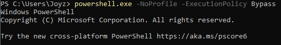
</p>

---

# 🚨 Detection & Analysis

After the PowerShell command was executed, the generated endpoint telemetry was collected by the Wazuh Agent and forwarded to the Wazuh Manager.

Using its default detection rules, Wazuh successfully identified the PowerShell activity and generated multiple alerts for analyst investigation.

---

## 📊 Figure 2. Wazuh Alert Overview

The Wazuh Dashboard provides an overview of the alerts generated after processing endpoint telemetry.

This view helps analysts quickly identify suspicious activity before performing detailed analysis.

<p align="center">
    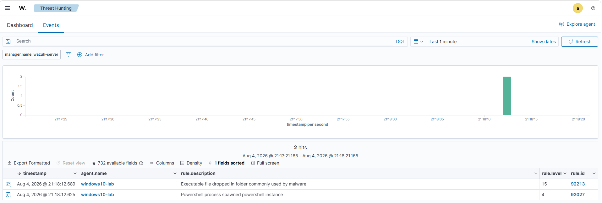
</p>

---

## Alert 1 — Rule 92027

| Property    | Value                                          |
| ----------- | ---------------------------------------------- |
| Rule ID     | **92027**                                      |
| Description | Powershell process spawned powershell instance |
| Data Source | Sysmon                                         |
| Severity    | Medium                                         |

Rule **92027** detects when a PowerShell process launches another PowerShell process. While this behavior can occur during legitimate administration, it is also commonly associated with PowerShell abuse and therefore deserves analyst attention.

### 📷 Figure 3A. Rule 92027 Overview

<p align="center">
    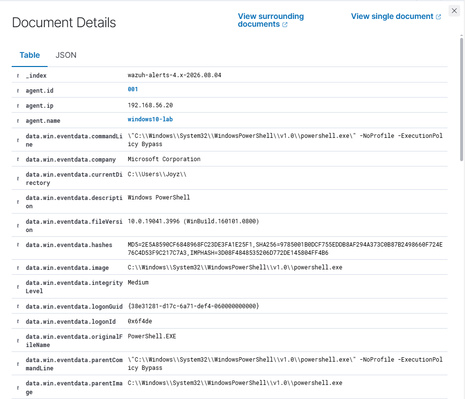
</p>

### 📷 Figure 3B. Rule 92027 Process Details

<p align="center">
    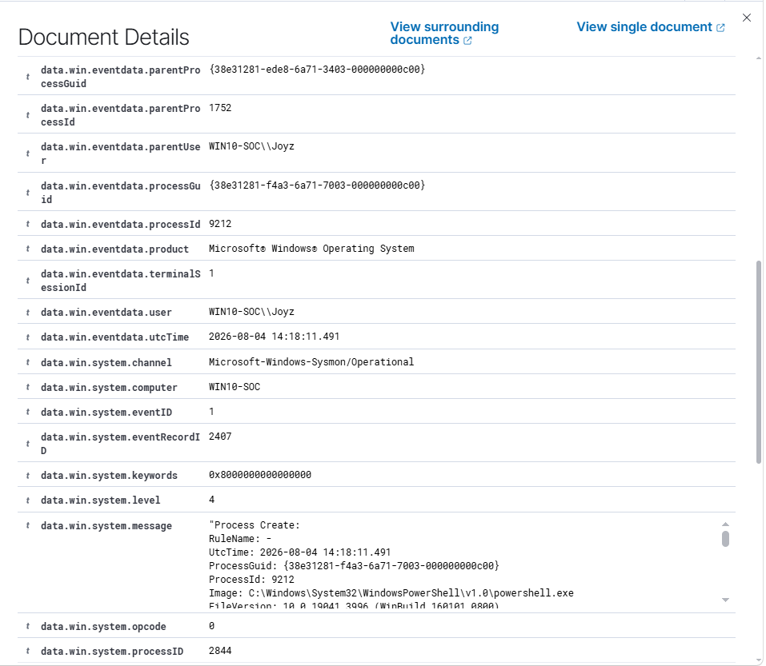
</p>

### 📷 Figure 3C. Rule 92027 Command Line

<p align="center">
    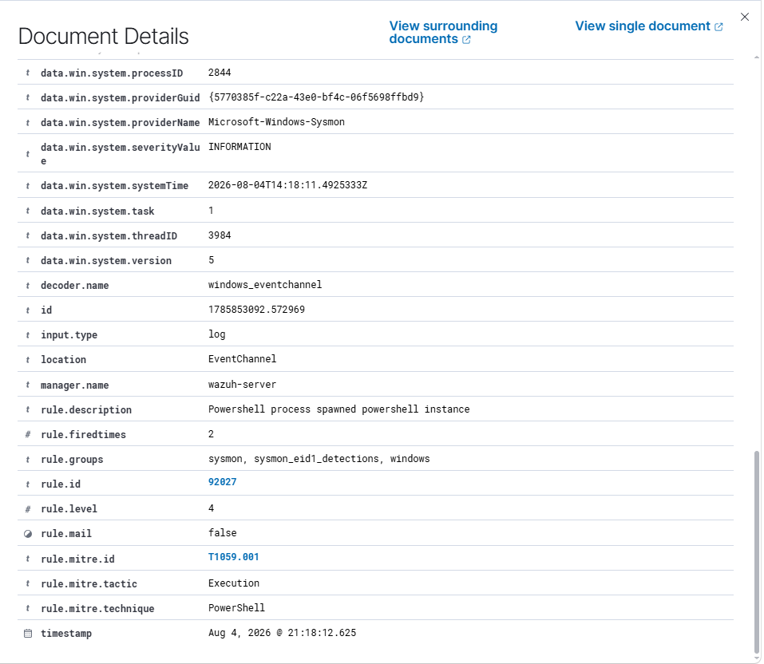
</p>

### Analysis

The alert successfully captured the execution of the following command:

```powershell
powershell.exe -NoProfile -ExecutionPolicy Bypass
```

The alert includes important process metadata such as:

- Process Image
- Parent Process
- Command Line
- User
- Process ID
- Process GUID
- Timestamp

These fields provide sufficient context for analysts to understand how the PowerShell process was started and to determine whether the activity requires further investigation.

**Assessment:** ✅ True Positive

---

## Alert 2 — Rule 92213

| Property    | Value                                                      |
| ----------- | ---------------------------------------------------------- |
| Rule ID     | **92213**                                                  |
| Description | Executable file dropped in folder commonly used by malware |
| Data Source | Sysmon                                                     |
| Severity    | High                                                       |

Rule **92213** was triggered after PowerShell created temporary execution policy validation files during startup.

### 📷 Figure 4A. Rule 92213 Overview

<p align="center">
    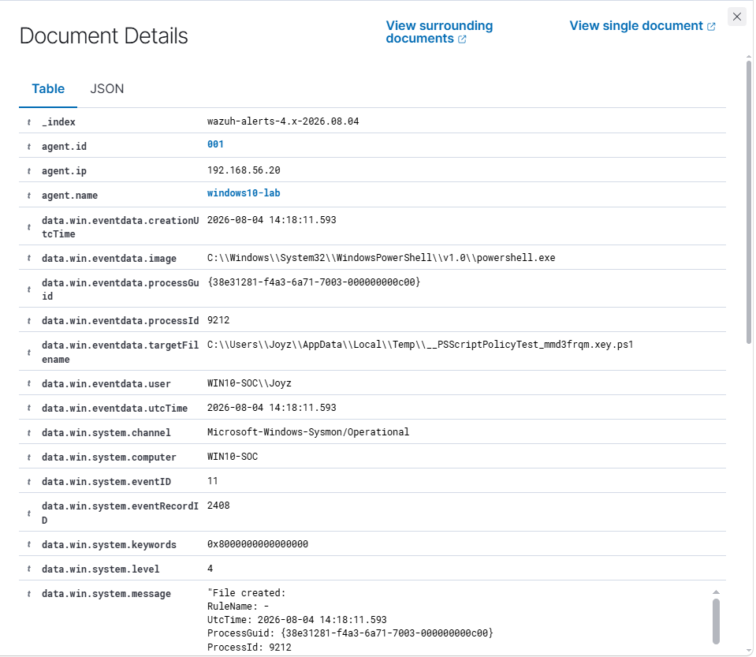
</p>

### 📷 Figure 4B. Rule 92213 File Details

<p align="center">
    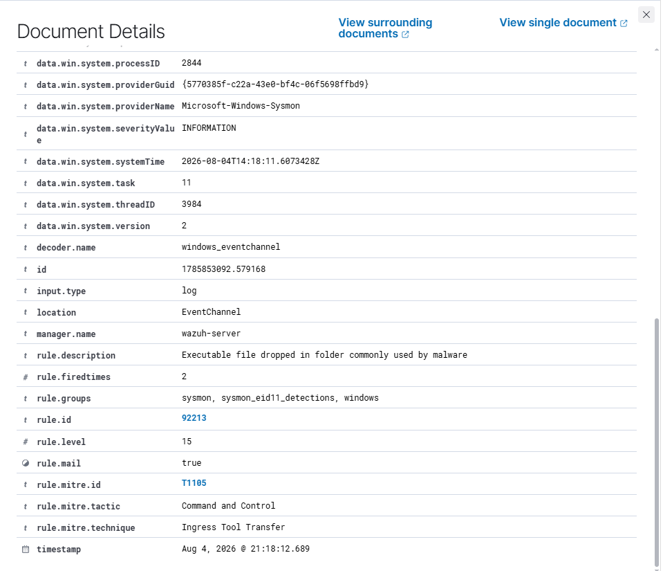
</p>

### Analysis

During execution, PowerShell automatically generated temporary files with names similar to:

```text
__PSScriptPolicyTest_*
```

These files are created by PowerShell while validating the current execution policy.

Within this controlled laboratory environment, the generated alert is expected and demonstrates that Wazuh successfully monitored the observed endpoint activity.

**Assessment:** ✅ True Positive

---

# 📜 Endpoint Telemetry

To validate the generated alerts, the underlying endpoint telemetry was reviewed using both **Sysmon** and **PowerShell Operational Logging**.

These log sources provide the raw evidence that supports the alerts generated by Wazuh.

---

## Sysmon Process Creation (Event ID 1)

Sysmon recorded the execution of **powershell.exe** as **Event ID 1 – Process Creation**.

The event contains detailed process metadata that assists analysts in reconstructing process execution, including:

- Process Image
- Command Line
- Parent Process
- User
- Process GUID
- Process ID
- Timestamp

### 📷 Figure 5A. Sysmon Event ID 1

<p align="center">
    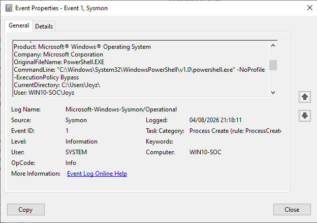
</p>

### 📷 Figure 5B. Sysmon Event Details

<p align="center">
    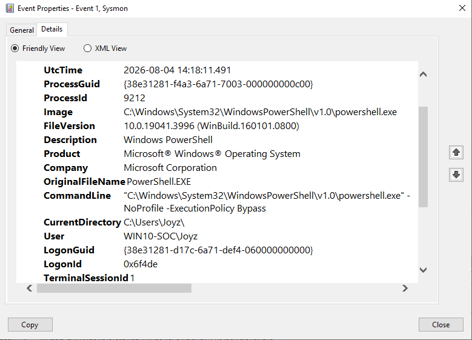
</p>

---

## PowerShell Operational Logging

PowerShell Operational Logging recorded additional information about the PowerShell engine during execution.

Compared to Sysmon, these events provide complementary visibility into PowerShell activity and help analysts validate that the execution occurred as expected.

### 📷 Figure 6A. PowerShell Operational Log

<p align="center">
    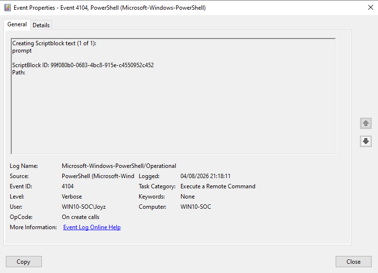
</p>

### 📷 Figure 6B. PowerShell Operational Event Details

<p align="center">
    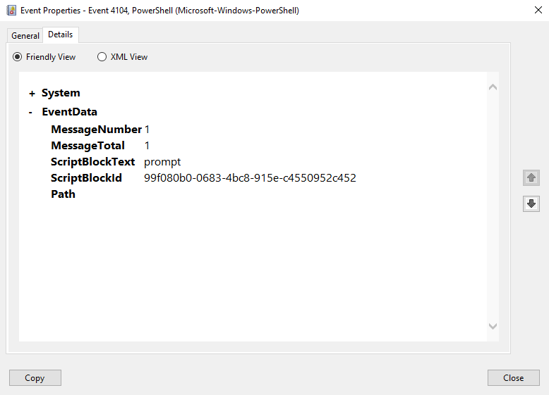
</p>

---

# 🔎 Threat Hunting

After validating the generated alerts, additional investigation was performed using the **Threat Hunting** feature in the Wazuh Dashboard.

Example queries used during the investigation:

```text
powershell
```

```text
rule.id:92027
```

These searches help correlate PowerShell activity with related endpoint events collected during the simulation.

### 📷 Figure 7. Threat Hunting Results

<p align="center">
    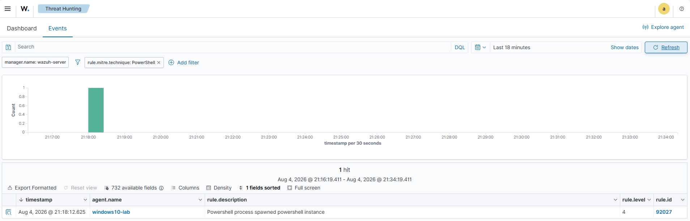
</p>

---

# 🛡️ MITRE ATT&CK Mapping

| Tactic    | Technique                                     | ATT&CK ID |
| --------- | --------------------------------------------- | --------- |
| Execution | Command and Scripting Interpreter: PowerShell | T1059.001 |

---

# 📂 Collected Evidence

### Screenshots

| File                                     | Description                                  |
| ---------------------------------------- | -------------------------------------------- |
| 01-powershell-execution.png              | PowerShell execution on the Windows endpoint |
| 02-wazuh-alert-overview.png              | Wazuh alert overview                         |
| 03A–03C-rule-92027-detail.png            | Rule 92027 investigation                     |
| 04A–04B-rule-92213-detail.png            | Rule 92213 investigation                     |
| 05A–05B-sysmon-event.png                 | Sysmon Process Creation events               |
| 06A–06B-powershell-operational-event.png | PowerShell Operational logs                  |
| 07-threat-hunting-query.png              | Threat Hunting investigation                 |

### Logs

| File                        | Description                                       |
| --------------------------- | ------------------------------------------------- |
| powershell-command.txt      | PowerShell command executed during the simulation |
| wazuh-alert-92027.json      | Exported Wazuh alert for Rule 92027               |
| wazuh-alert-92213.json      | Exported Wazuh alert for Rule 92213               |
| sysmon-event.xml            | Exported Sysmon Event ID 1                        |
| powershell-operational.evtx | Exported PowerShell Operational log               |
| security.evtx               | Exported Windows Security log                     |
| triage-notes.md             | Investigation notes                               |

---

# 📚 Lessons Learned

This scenario demonstrates how endpoint telemetry can be used to detect and investigate PowerShell execution without relying on custom detection rules.

Key takeaways from this exercise include:

- Sysmon provides detailed process creation telemetry that supports endpoint investigations.
- PowerShell Operational Logging complements Sysmon by recording PowerShell engine activity.
- Wazuh default rules successfully detected the simulated PowerShell execution.
- Combining multiple telemetry sources improves investigation accuracy and provides better context for alert validation.
- Even legitimate administrative tools such as PowerShell should be monitored because they are frequently abused by attackers.

---

## ✅ Scenario Outcome

The objectives of this scenario were successfully achieved:

- PowerShell execution was successfully simulated.
- Sysmon Process Creation logging was validated.
- PowerShell Operational Logging was successfully collected.
- Wazuh generated alerts using its default detection rules.
- Endpoint telemetry was investigated through the Wazuh Dashboard.
- Threat hunting was performed to validate the collected evidence.
- The observed activity was successfully mapped to the MITRE ATT&CK framework.

---
