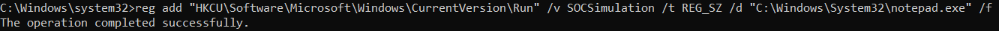
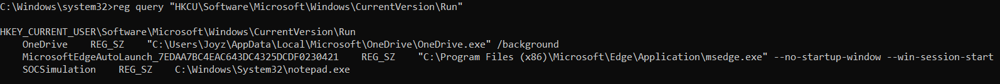
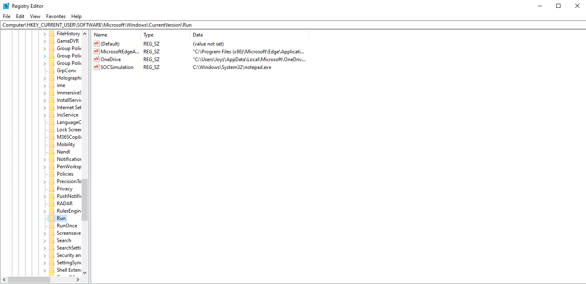
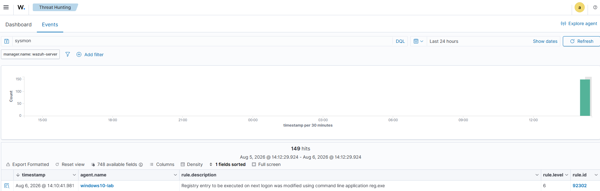
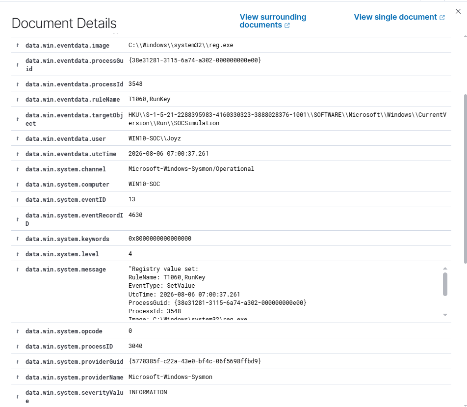
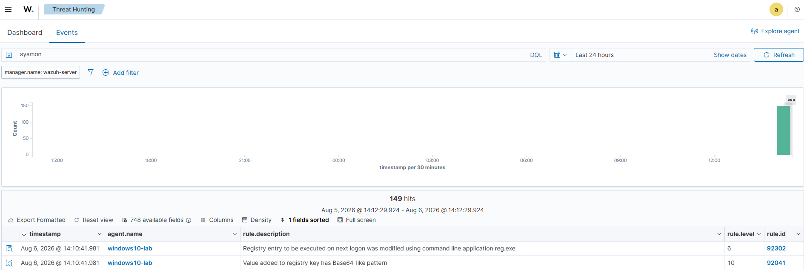
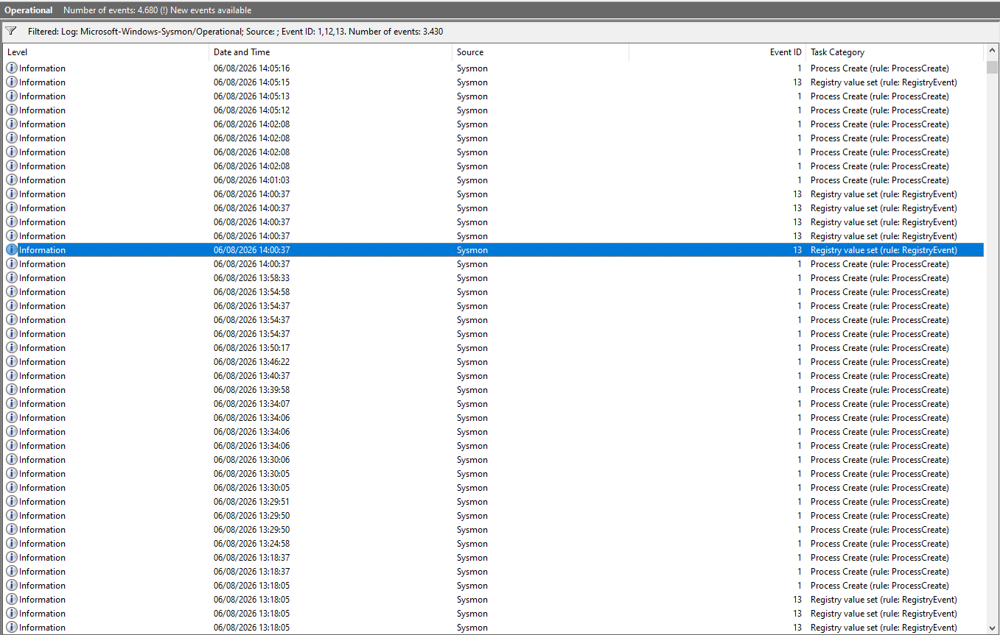
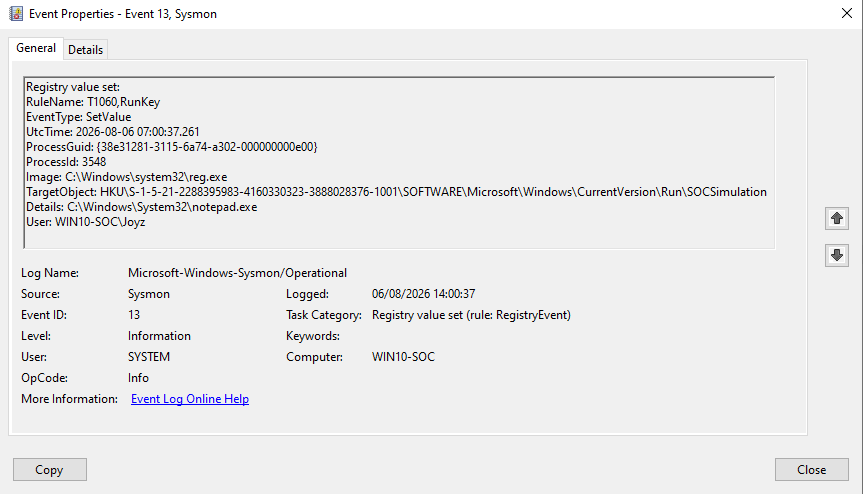

# Scenario 3 – Windows Registry Run Key Persistence Detection


---

# 📌 Scenario Overview

This scenario demonstrates how **Windows Registry Run Key Persistence** can be detected and investigated using **Sysmon** and **Wazuh SIEM**.

Instead of deploying real malware, the simulation focuses on creating a benign Registry Run Key that launches **Notepad** during user logon. This approach safely reproduces one of the most common persistence techniques used by adversaries while generating realistic endpoint telemetry for security monitoring.

After the registry modification was performed, Sysmon recorded the activity, the Wazuh Agent forwarded the generated telemetry to the Wazuh Manager, and the default detection rules successfully identified the persistence technique.

This scenario validates the complete detection workflow from registry modification to alert generation and analyst investigation.

---

# 🎯 Objectives

- Simulate Windows Registry Run Key persistence.
- Validate Sysmon Registry Event logging.
- Verify registry telemetry collection by the Wazuh Agent.
- Investigate alerts generated by Wazuh default detection rules.
- Perform basic threat hunting using the Wazuh Dashboard.
- Map the observed activity to the MITRE ATT&CK Framework.

---

# 🖥️ Lab Environment

| Component             | Description                   |
| --------------------- | ----------------------------- |
| Target Endpoint       | Windows 10                    |
| SIEM Server           | Ubuntu Server (Wazuh Manager) |
| SIEM Platform         | Wazuh                         |
| Endpoint Monitoring   | Sysmon                        |
| Persistence Technique | Windows Registry Run Key      |
| Detection Rules       | Wazuh Default Rules           |

---

# ⚙️ Attack Simulation

Registry Run Key Persistence was simulated by creating a new registry value under the current user's **Run** key using the built-in Windows **reg.exe** utility.

```cmd
reg add "HKCU\Software\Microsoft\Windows\CurrentVersion\Run" ^
/v SOCSimulation ^
/t REG_SZ ^
/d "C:\Windows\System32\notepad.exe" ^
/f
```

The registry value points to **Notepad**, which serves as a safe payload for demonstrating persistence without executing malicious software.

Although the payload is benign, the registry modification closely resembles persistence techniques commonly used by attackers to achieve automatic execution after user logon.

### 📷 Figure 1. Registry Run Key Creation

<p align="center">
    
</p>

### 📷 Figure 2. Registry Verification

<p align="center">
    
</p>

### 📷 Figure 3. Registry Editor Verification

<p align="center">
    
</p>

---

# 🚨 Detection & Analysis

After the registry value was created, the generated endpoint telemetry was collected by the Wazuh Agent and forwarded to the Wazuh Manager.

Using its default detection rules, Wazuh successfully identified the Registry Run Key modification and generated alerts for analyst investigation.

---

## Alert 1 — Rule 92302

| Property    | Value                                                                                           |
| ----------- | ----------------------------------------------------------------------------------------------- |
| Rule ID     | **92302**                                                                                       |
| Description | Registry entry to be executed on next logon was modified using command line application reg.exe |
| Data Source | Sysmon                                                                                          |
| Severity    | Medium                                                                                          |

Rule **92302** detects registry modifications associated with Windows Run Keys when they are performed using **reg.exe**.

This behavior is commonly associated with persistence techniques and is mapped to the MITRE ATT&CK Framework.

### 📷 Figure 4A. Rule 92302 Overview

<p align="center">
    
</p>

### 📷 Figure 4B. Rule 92302 Details

<p align="center">
    
</p>

### Analysis

The alert successfully captured the registry modification performed by the following command:

```cmd
reg add "HKCU\Software\Microsoft\Windows\CurrentVersion\Run" /v SOCSimulation /t REG_SZ /d "C:\Windows\System32\notepad.exe" /f
```

The alert includes important endpoint telemetry such as:

- Process Image
- Target Registry
- Registry Value
- User
- Process ID
- Process GUID
- Timestamp

These fields provide sufficient context for analysts to identify the persistence mechanism and validate the generated alert.

**Assessment:** ✅ True Positive

---

## Alert 2 — Rule 92041

| Property    | Value                                               |
| ----------- | --------------------------------------------------- |
| Rule ID     | **92041**                                           |
| Description | Value added to registry key has Base64-like pattern |
| Data Source | Sysmon                                              |
| Severity    | High                                                |

Rule **92041** was also generated during the simulation.

### 📷 Figure 5. Rule 92041 Overview

<p align="center">
    
</p>

### Analysis

Although the rule classified the registry value as containing a Base64-like pattern, manual investigation confirmed that the configured payload was simply:

```text
C:\Windows\System32\notepad.exe
```

No encoded or obfuscated content was present.

Within this controlled laboratory environment, the alert was therefore classified as a **False Positive**.

**Assessment:** ⚠️ False Positive

---

# 📊 Endpoint Telemetry

Sysmon successfully captured the Registry Run Key modification and generated detailed endpoint telemetry that was forwarded to the Wazuh Manager for analysis.

The telemetry provides valuable forensic information that allows security analysts to reconstruct the persistence activity.

### 📷 Figure 6A. Sysmon Event ID 13 Overview

<p align="center">
    
</p>

### 📷 Figure 6B. Sysmon Event ID 13 Details

<p align="center">
    
</p>

### Telemetry Analysis

The generated Sysmon event contains several important artifacts that support the investigation.

| Artifact       | Value                                              |
| -------------- | -------------------------------------------------- |
| Event ID       | 13                                                 |
| Event Type     | Registry Value Set                                 |
| Process        | reg.exe                                            |
| Registry Path  | HKCU\Software\Microsoft\Windows\CurrentVersion\Run |
| Registry Value | SOCSimulation                                      |
| Payload        | C:\Windows\System32\notepad.exe                    |
| User           | WIN10-SOC\Joyz                                     |

These artifacts provide sufficient evidence to identify the persistence technique and validate the corresponding Wazuh alert.

---

# 🔎 Threat Hunting

After confirming the generated alerts, additional threat hunting was performed using the Wazuh Dashboard to validate the observed activity and collect supporting evidence.

The following queries can be used to locate the persistence event.

### Search by Rule ID

```kql
rule.id:92302
```

### Search by Sysmon Event ID

```kql
data.win.system.eventID:13
```

### Search by Registry Value

```kql
SOCSimulation
```

### Search by Process

```kql
reg.exe
```

These searches help analysts quickly locate related events and verify that the registry modification corresponds to the simulated persistence activity.

---

# 🛡️ MITRE ATT&CK Mapping

| Tactic               | Technique                          | Technique ID |
| -------------------- | ---------------------------------- | ------------ |
| Persistence          | Registry Run Keys / Startup Folder | T1547.001    |
| Privilege Escalation | Registry Run Keys / Startup Folder | T1547.001    |

The generated alert correctly maps the observed behavior to **MITRE ATT&CK T1547.001**, which covers persistence mechanisms implemented through Windows Registry Run Keys.

This mapping provides valuable context for security analysts when performing threat classification and incident triage.

---

# 📂 Collected Evidence

The following artifacts were collected throughout the simulation.

| Evidence              | Description                                  |
| --------------------- | -------------------------------------------- |
| Attack Command        | Registry Run Key creation using reg.exe      |
| Registry Verification | Verification using reg query                 |
| Registry Editor       | Confirmation through Windows Registry Editor |
| Sysmon Event ID 13    | Registry Value Set event                     |
| Wazuh Rule 92302      | Registry persistence detection               |
| Wazuh Rule 92041      | False Positive alert for validation          |
| Rule JSON 92302       | Raw Wazuh alert                              |
| Rule JSON 92041       | Raw Wazuh alert                              |

Repository Structure

```text
03-windows-persistence/
│
├── README.md
│
├── logs/
│   ├── rule92041.json
│   └── rule92302.json
│
└── screenshots/
    ├── attack/
    ├── sysmon/
    └── wazuh/
```

---

# 📚 Lessons Learned

This scenario demonstrates that even a simple Registry Run Key modification can generate valuable endpoint telemetry for detection and investigation.

Key takeaways from this exercise include:

- Windows Registry Run Keys remain a common persistence mechanism used by adversaries.
- Sysmon Event ID 13 provides detailed visibility into registry modifications.
- Wazuh successfully correlates Sysmon telemetry with built-in detection rules.
- Analyst validation is essential to distinguish true positives from false positives.
- MITRE ATT&CK mapping improves alert categorization and investigation efficiency.
- Effective threat hunting relies on understanding endpoint telemetry rather than alert severity alone.

---

# ✅ Scenario Outcome

The simulation successfully demonstrated the complete detection workflow for **Windows Registry Run Key Persistence**.

The persistence technique was executed using the native Windows `reg.exe` utility, recorded by Sysmon as **Event ID 13**, and successfully detected by Wazuh through **Rule 92302**.

During the investigation, an additional alert (**Rule 92041**) was generated. Manual analysis confirmed that the registry value contained a legitimate executable path rather than Base64-encoded content, allowing the alert to be accurately classified as a **False Positive**.

Overall, this scenario validates the effectiveness of integrating **Sysmon** with **Wazuh** to detect persistence techniques while reinforcing the importance of analyst verification during the incident investigation process.
