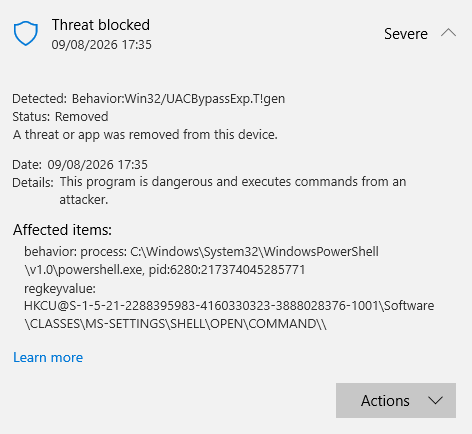
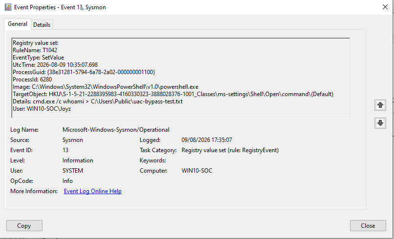
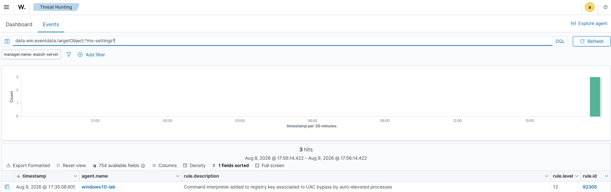

# Scenario 4 — Privilege Escalation Detection

This scenario focuses on detecting an **attempted privilege escalation attack on a Windows 10 endpoint** using a **User Account Control (UAC) bypass technique involving `fodhelper.exe`**.

The simulation was designed to reproduce attacker behavior involving Registry modification and evaluate whether endpoint telemetry and SIEM monitoring could identify the activity.

During the test, the Registry modification generated telemetry through **Sysmon** and was subsequently detected by **Wazuh**. However, **Windows Defender detected and removed the payload before the UAC bypass could be successfully completed**.

Therefore, this scenario demonstrates a **successful detection of a privilege escalation attempt**, rather than a successful privilege escalation.

---

## Overview

**Privilege escalation** is the process by which an attacker attempts to obtain higher privileges than those initially available to them.

On Windows systems, attackers may attempt to abuse **User Account Control (UAC)** to execute processes with elevated privileges.

This scenario focuses on a UAC bypass technique involving `fodhelper.exe` and Registry manipulation.

The objective was not to establish persistence or deploy malware, but to generate realistic security telemetry that could be investigated from a **Security Operations Center (SOC)** perspective.

The investigation involved three primary security components:

- **Sysmon** — Windows endpoint telemetry
- **Wazuh** — SIEM and security monitoring platform
- **Windows Defender** — Endpoint protection and malware detection

---

## Objectives

The main objectives of this scenario were to:

- Simulate an attempted privilege escalation attack against Windows 10.
- Generate Registry modification telemetry.
- Validate Sysmon visibility into suspicious Registry activity.
- Determine whether Wazuh could detect the activity.
- Analyze the resulting security alerts from a SOC Analyst perspective.
- Map the observed activity to the **MITRE ATT&CK framework**.
- Evaluate how endpoint protection and SIEM monitoring complement each other.

---

## Lab Environment

| Component        | Role                            |
| ---------------- | ------------------------------- |
| Kali Linux       | Attacker / Simulation Machine   |
| Windows 10       | Target Endpoint                 |
| Ubuntu Server    | Wazuh Manager / SIEM            |
| Wazuh            | Security Monitoring & Detection |
| Sysmon           | Windows Endpoint Telemetry      |
| Windows Defender | Endpoint Protection             |

### Network Architecture

All attack activity was performed inside an isolated **Host-Only network** to ensure that the simulation remained within the controlled laboratory environment.

```text
┌─────────────────┐
│   Kali Linux    │
│     Attacker    │
└────────┬────────┘
         │
         │ Host-Only Network
         │
         ▼
┌─────────────────┐
│   Windows 10    │
│     Target      │
│                 │
│     Sysmon      │
│ Windows Defender│
└────────┬────────┘
         │
         │ Security Telemetry
         ▼
┌─────────────────┐
│  Ubuntu Server  │
│      Wazuh      │
│       SIEM      │
└─────────────────┘
```

---

## Attack Technique

### UAC Bypass via `fodhelper.exe`

**MITRE ATT&CK Technique:**

```text
T1548.002 — Abuse Elevation Control Mechanism:
            Bypass User Account Control
```

The technique involves abusing Windows configuration and Registry mechanisms associated with `ms-settings`.

The simulated Registry location was:

```text
HKU\<User-SID>_Classes\ms-settings\Shell\Open\command
```

The test payload used during the simulation was:

```text
cmd.exe /c whoami > C:\Users\Public\uac-bypass-test.txt
```

The command was intentionally simple and served as an execution indicator rather than a malicious payload.

---

# Attack Simulation

The simulation was performed against the Windows 10 target inside the isolated laboratory environment.

The test generated a Registry modification targeting:

```text
HKU\<User-SID>_Classes\ms-settings\Shell\Open\command\(Default)
```

The Registry value contained:

```text
cmd.exe /c whoami > C:\Users\Public\uac-bypass-test.txt
```

This activity generated endpoint telemetry that was subsequently observed by Sysmon and processed by Wazuh.

### Attack Result

The privilege escalation attempt **did not successfully complete**.

Windows Defender detected the activity and removed the payload before the UAC bypass could be successfully executed.

The final outcome is therefore classified as:

> **Privilege Escalation Attempt Detected — Privilege Escalation Unsuccessful**

---

# Detection Results

The detection pipeline for this scenario was:

```text
Registry Modification
        │
        ▼
      Sysmon
        │
        ▼
   Wazuh Agent
        │
        ▼
   Wazuh Manager
        │
        ▼
   Security Alert
```

At the same time, Windows Defender provided endpoint-level protection:

```text
Suspicious Activity
        │
        ▼
 Windows Defender
        │
        ▼
 Detection & Removal
```

This provided a **defense-in-depth** view of the attack attempt.

Windows Defender prevented the payload from completing its intended objective, while Sysmon and Wazuh provided security telemetry and centralized detection visibility.

---

# Windows Defender Detection

Windows Defender generated the following detection:

```text
Behavior:Win32/UACBypassExp.T!gen
```

### Detection Details

| Field     | Result                              |
| --------- | ----------------------------------- |
| Detection | `Behavior:Win32/UACBypassExp.T!gen` |
| Severity  | Severe                              |
| Action    | Removed                             |

The detection indicates that Windows Defender identified behavior associated with a UAC bypass attempt and removed the corresponding payload.

### SOC Significance

From a SOC Analyst perspective, this detection is significant because the activity involved:

- A Registry location associated with UAC bypass behavior.
- A command intended to execute through the modified Registry configuration.
- A known UAC bypass behavior classification from Windows Defender.
- Additional telemetry from Sysmon and Wazuh.

The Defender detection therefore provides an important endpoint-level indicator that can be correlated with SIEM telemetry.

---

# Sysmon Evidence

Sysmon generated **Event ID 13 — RegistryEvent (SetValue)**.

This event recorded the modification of:

```text
HKU\<User-SID>_Classes\ms-settings\Shell\Open\command\(Default)
```

The Registry value contained:

```text
cmd.exe /c whoami > C:\Users\Public\uac-bypass-test.txt
```

### Why Event ID 13 Matters

Sysmon Event ID 13 provides visibility into Registry value modifications.

Registry modifications are particularly valuable for security monitoring because attackers may abuse the Windows Registry for:

- Execution
- Persistence
- Privilege Escalation
- Defense Evasion

In this scenario, the Registry modification was associated with a UAC bypass attempt.

---

# Wazuh Detection

Wazuh generated an alert associated with the observed UAC bypass activity.

### Alert Details

| Field                | Value                 |
| -------------------- | --------------------- |
| Rule ID              | `92305`               |
| Alert Level          | `12`                  |
| MITRE ATT&CK         | `T1548.002`           |
| Additional Technique | `T1112`               |
| Event Type           | Registry Modification |

The alert provided a correlation between the suspicious Registry modification and the corresponding MITRE ATT&CK techniques.

### MITRE ATT&CK Context

The alert was associated with:

```text
T1548.002 — Bypass User Account Control
```

and:

```text
T1112 — Modify Registry
```

This mapping provides additional context for the SOC Analyst by identifying both the suspected objective and the behavior used to support it.

---

# SOC Analysis

## Observed Indicators

Several indicators were identified during the investigation.

### 1. Suspicious Registry Path

```text
HKU\<User-SID>_Classes\ms-settings\Shell\Open\command
```

The Registry path is relevant to the simulated UAC bypass technique.

### 2. Registry Value Modification

Sysmon recorded:

```text
Event ID 13 — RegistryEvent (SetValue)
```

This confirms that a Registry value was modified.

### 3. Suspicious Command

The Registry value contained:

```text
cmd.exe /c whoami > C:\Users\Public\uac-bypass-test.txt
```

The command was used as an execution indicator during the simulation.

### 4. Windows Defender Detection

Windows Defender reported:

```text
Behavior:Win32/UACBypassExp.T!gen
```

with a **Severe** classification and the payload was removed.

### 5. Wazuh Alert

Wazuh generated:

```text
Rule ID: 92305
Level: 12
```

with MITRE ATT&CK mapping relevant to the observed activity.

---

## SOC Triage Assessment

From a SOC Analyst perspective, the event can be assessed as follows:

| Category             | Assessment                       |
| -------------------- | -------------------------------- |
| Activity             | UAC Bypass Attempt               |
| Event                | Suspicious Registry Modification |
| Detection            | True Positive                    |
| Severity             | High                             |
| MITRE Technique      | T1548.002                        |
| Secondary Technique  | T1112                            |
| Endpoint Protection  | Windows Defender                 |
| SIEM Detection       | Wazuh                            |
| Privilege Escalation | **Not Successful**               |

### Why This Is a True Positive

The alert can be classified as a **True Positive** because multiple independent indicators support the same conclusion:

1. A suspicious Registry path was modified.
2. Sysmon recorded the Registry modification.
3. The Registry value contained an execution command.
4. Windows Defender identified the activity as a UAC bypass behavior.
5. Wazuh generated a corresponding security alert.
6. The observed activity aligns with MITRE ATT&CK T1548.002.

The combination of these indicators significantly increases confidence that the activity represents a genuine attack attempt rather than benign Registry modification.

---

# Detection Outcome

The overall attack flow can be summarized as:

```text
Privilege Escalation Attempt
            │
            ▼
   Registry Modification
            │
            ▼
     Sysmon Event ID 13
            │
      ┌─────┴─────┐
      ▼           ▼
 Windows Defender Wazuh
      │           │
      ▼           ▼
  Detected       Alert
      │
      ▼
 Payload Removed
      │
      ▼
Privilege Escalation
     FAILED
```

### Result Summary

| Detection Stage                      | Result               |
| ------------------------------------ | -------------------- |
| Registry modification attempt        | ✅ Observed          |
| Sysmon telemetry                     | ✅ Detected          |
| Windows Defender detection           | ✅ Detected          |
| Payload removal                      | ✅ Confirmed         |
| Wazuh alert                          | ✅ Generated         |
| MITRE ATT&CK mapping                 | ✅ T1548.002 / T1112 |
| Successful `fodhelper.exe` execution | ❌ Not confirmed     |
| Successful privilege escalation      | ❌ Not achieved      |

> **Important:** The evidence supports detection of an attempted privilege escalation, but does not support a claim that privilege escalation was successfully achieved.

---

# Detection Gap & Security Observation

This scenario demonstrates the importance of **defense-in-depth** in a SOC environment.

Windows Defender successfully detected and removed the payload. However, endpoint prevention alone does not eliminate the need for security monitoring.

Sysmon and Wazuh provided additional visibility into the activity, including:

- The modified Registry path.
- The Registry value.
- The associated command.
- Event timestamp.
- Detection context.
- MITRE ATT&CK classification.

This allows a SOC Analyst to investigate the event even when the endpoint security product successfully prevents the attack from completing.

From a monitoring perspective, the important conclusion is:

> **A blocked attack is still a security event that may require investigation.**

---

# Lessons Learned

### 1. Attack Attempts and Successful Compromise Are Different

A SOC Analyst must distinguish between:

```text
Attack Attempt
```

and:

```text
Successful Compromise
```

In this scenario, the attack attempt was successfully detected, but the privilege escalation itself was prevented.

### 2. Registry Monitoring Provides Valuable Visibility

Sysmon Event ID 13 can provide useful telemetry for identifying suspicious Registry activity.

Registry monitoring is particularly relevant for detecting behaviors associated with:

- Execution
- Persistence
- Privilege Escalation
- Defense Evasion

### 3. SIEM and Endpoint Protection Complement Each Other

Windows Defender provided endpoint-level prevention and detection, while Wazuh provided centralized security monitoring and alerting.

This demonstrates how multiple security controls can provide complementary visibility across an attack lifecycle.

### 4. MITRE ATT&CK Adds Investigation Context

Mapping the activity to:

```text
T1548.002 — Bypass User Account Control
```

and:

```text
T1112 — Modify Registry
```

helps a SOC Analyst understand the behavior and potential attacker objective.

---

# Evidence

The following evidence was collected during the scenario:

## Windows Defender



## Sysmon



Target Registry path:

```text
HKU\<User-SID>_Classes\ms-settings\Shell\Open\command\(Default)
```

## Wazuh



---

# Project Structure

```text
04-Privilege-Escalation/
│
├── README.md
│
├── screenshots/
│   ├── 01-defender-uac-bypass-blocked.png
│   ├── 02-wazuh-rule92305.png
│   └── 03-sysmon-event-13.png
│
└── logs/
    └── wazuh-uac-bypass-alert.json
```

> File names may be adjusted to match the actual evidence stored in the repository.

---

# MITRE ATT&CK Mapping

| Technique ID  | Technique                   | Evidence                                     |
| ------------- | --------------------------- | -------------------------------------------- |
| **T1548.002** | Bypass User Account Control | UAC bypass Registry activity and Wazuh alert |
| **T1112**     | Modify Registry             | Sysmon Event ID 13                           |

---

# Conclusion

Scenario 4 demonstrated how a **privilege escalation attempt** can be detected and investigated even when the attack does not successfully achieve elevated privileges.

The simulated UAC bypass activity generated a suspicious Registry modification that was captured by **Sysmon Event ID 13**.

Windows Defender subsequently detected the activity as:

```text
Behavior:Win32/UACBypassExp.T!gen
```

and removed the payload.

At the SIEM level, **Wazuh Rule 92305 (Level 12)** generated an alert associated with:

```text
T1548.002 — Bypass User Account Control
T1112    — Modify Registry
```

The final outcome was therefore:

> **Privilege Escalation Attempt Detected — Privilege Escalation Prevented**

This scenario demonstrates the value of combining **endpoint telemetry, endpoint protection, SIEM alerting, and MITRE ATT&CK mapping** to investigate suspicious activity from a SOC Analyst perspective.

---

## Skills Demonstrated

- Windows Security Monitoring
- Sysmon Event Analysis
- Registry Activity Analysis
- Wazuh SIEM
- Security Alert Triage
- MITRE ATT&CK Mapping
- UAC Bypass Detection
- Endpoint Detection & Response Concepts
- Detection Engineering
- SOC Investigation
